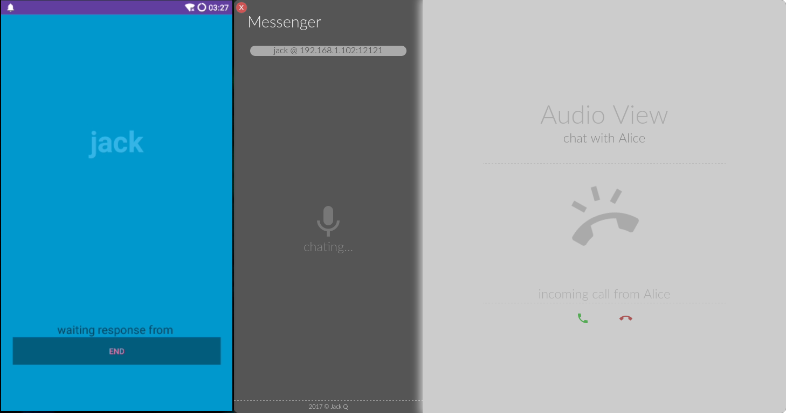

# Messenger, Chat on multiple platforms

[](https://travis-ci.org/Jack-Q/messenger)

Messenger is a simple chat application for desktop platform (Windows, Mac OS, Linux) and mobile platform (Android),
which supports both text based chatting and audio based chatting.


## Screenshots


| | |
|:------:|:-------:|
| | |


## Network

### Basic Structure
```
    ___________UDP___________
    |                       |
Client 1 -TCP-\     /-TCP- Client 2
              |     |
              |     |
          Central server
```

### Protocol

* Client-Server Protocol: [client-server](./protocol/client-server.md)
* Peer-to-Peer Protocol: [peer-to-peer](./protocol/peer-to-peer.md)

### P2P over NAT (NAT hole punching)

Client-Server Protocol Peer-to-Peer Protocol provides a simple implementation of P2P over NAT.

```
           | (host:port) |  
Client 1   |    Server   |     Client 2
     \---NAT---/     \---NAT---/
           |             |
           |             |

                 ||
                 \/

           |             |  
Client 1   |    Server   |     Client 2
     \---NAT-------------NAT---/
           |             |
           |             |
```

* Server has public accessible UDP address (host:port);
* Client 1 sends packet to server, then server knows its NAT mapped UDP address. Server send this information to Client 2;
* Client 2 sends packet to server, then server knows its NAT mapped UDP address. Server send this information to Client 1;
* Client 1 sends packet to Client 2 with address received from Server;
* Client 2 sends packet to Client 1 with address received from Server;
* If Client 1 or Client 2 can receive UDP packet from peer, then P2P communication is viable in between.


## Audio Processing

### Audio Recording

For desktop client, the audio data is recorded by Web API, while for mobile client, that is done with Android API.
* WebAudio: [`MediaRecorder`](https://developer.mozilla.org/en-US/docs/Web/API/MediaStream_Recording_API/Using_the_MediaStream_Recording_API)
* Android SDK: [`MediaRecorder`](https://developer.android.com/guide/topics/media/mediarecorder.html)

### Audio Encoding

Audio data collected via platform specific API is sliced and encoded before transmission over network.
The encoding method used by `messenger` is OPUS encoding.

* Implementation [http://opus-codec.org](http://opus-codec.org)
* RFC 6716 [https://tools.ietf.org/html/rfc6716](https://tools.ietf.org/html/rfc6716)

### Desktop Client Audio Processing Flow
```
           Sender                  Receiver
         Microphone            Headphone/Speaker
     Recorder |                 Player |
        [Float32Array]        [AudioBufferSource]
     PcmCodec |                        |
         [Int16Array]            [AudioBuffer]
InFrameBuffer |         OutFrameBuffer |
          [PcmFrame]              [PcmFrame]
    OpusCodec |                        |
         [OpusFrame]              [OpusFrame]
  AudioPacker |                        |
      [AudioPacketData]        [AudioPacketData] 
  UdpProtocol |                        |
        [UDP-Packet]             [UDP-Packet]
              |                        |
              \-[UDP Socket & Network]-/
```


## Miscellaneous

### Build native module in node
Since `electron` is generally bundled a different version of `v8` than nodejs, the native node module requires recompiling to work correctly.
Use the `electron-rebuild` package for this task.

****
MIT Licence. Copyright (c) 2017 Jack Q
